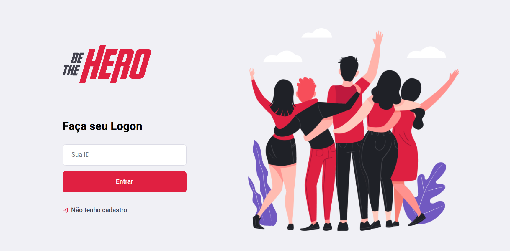
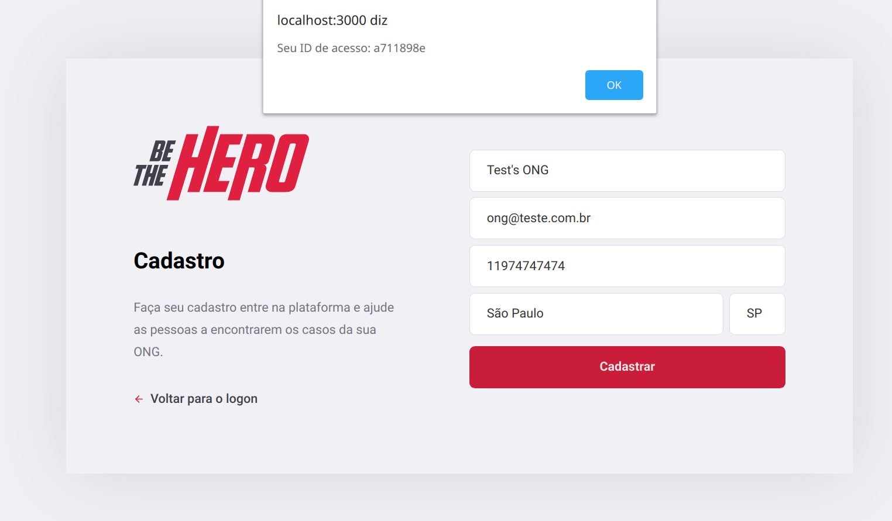

# BE THE HERO

## Tecnologias utilizadas:

* NodeJS
* SQLite
* ReactJS
* React Native

### Descrição da aplicação: 

  Aplicação desenvolvida para ONG's que precisam de ajuda financeira, por exemplo, ONG's que cuidam de animais de rua e que estes necessitam de tratamentos cirúrgicos, ou até mesmo ONG's que ajudam moradores em vulnerabilidade socioeconômica e entre outras. 
  
  Siga abaixo mais detalhes da aplicação :heart_eyes:!
  
#### Primeira Página:
  Nesta primeira página temos o pedido do ID de cadastro da **ONG**, lembrando que a parte de website **só terá acesso** as Organizações Não-Governamentais.
  
  
  
Caso a ONG não tenha cadastro ainda, clicar em **Não tenho cadastro**

#### Segunda página: 

Nesta página, a ONG terá de preencher um formulário de acordo com o pedido de informações nele contido:

**OBS:** A ONG precisa a anotar seu ID de acesso que aparecerá na janela para ter acesso as funcionalidades.

  
  
