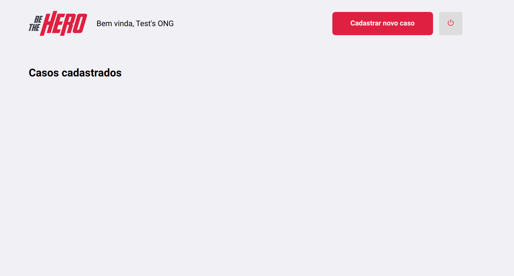
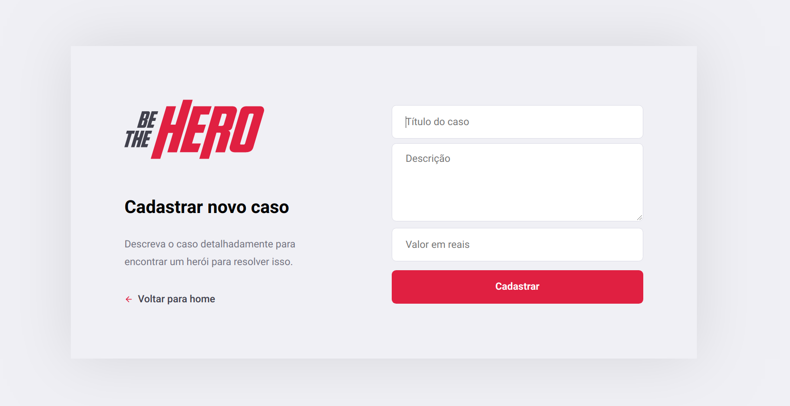
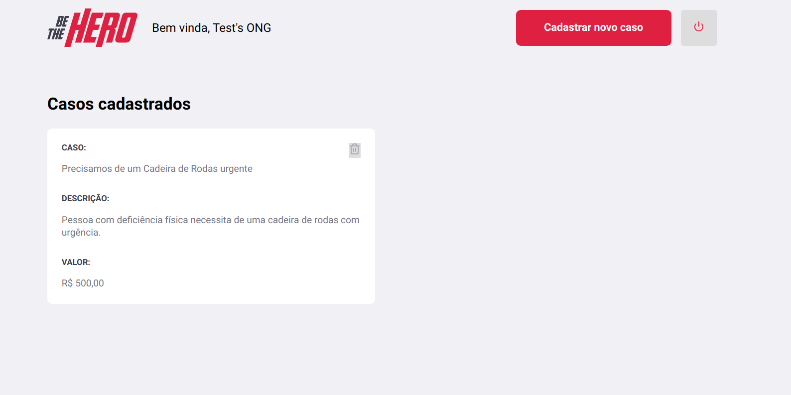

# BE THE HERO

## Tecnologias utilizadas:

* NodeJS
* Expo
* Express
* Nodemon
* Axios
* Cors
* ESlint
* Jest
* SQLite
* ReactJS
* React Native

### Descrição da aplicação: 

  Aplicação desenvolvida para ONG's que precisam de ajuda financeira, por exemplo, ONG's que cuidam de animais de rua e que estes necessitam de tratamentos cirúrgicos, ou até mesmo ONG's que ajudam moradores em vulnerabilidade socioeconômica e entre outras. 
  
  Siga abaixo mais detalhes da aplicação :heart_eyes:!
  
#### Primeira Página:
  Nesta primeira página temos o pedido do ID de cadastro da **ONG**, lembrando que a parte de website **só terá acesso** as Organizações Não-Governamentais.
  
  
  
Caso a ONG não tenha cadastro ainda, clicar em **Não tenho cadastro**

#### Segunda página: 

Nesta página, a ONG terá de preencher um formulário de acordo com o pedido de informações nele contido:

**OBS:** A ONG precisa a anotar seu ID de acesso que aparecerá na janela para ter acesso as funcionalidades.

Após anotar concluir o cadastro, o site redirecionará para a primeira página de Logon, o qual a ONG terá de preencher com o ID gerado após o seu cadastro.

#### Terceira página:

Após a entrada, será apresentado todos os casos cadastrados da ONG, como não houve cadastros ainda, a página estará dessa forma: 

  
 Ao clicar em **Cadastrar novo caso** irá ser redirecionado para a seguinte página.
 
 #### Quarta página:
 
 Nesta sessão, a ONG precisa preencher o formulário que vai especificar o caso a ser cadastrado na plataforma de casos.
 
 
 
 Ao clicar em **Cadastrar** a página automaticamente vai para a sessão de casos cadastrados, que seria a terceira página novamente, mas preenchida com o caso cadastrado.
 
 
  
Onde a ONG terá controle dos casos cadastrados, podendo adicionar mais casos ou até mesmo excluí-los.

### O Aplicativo mobile:
O aplicativo foi desenvolvido para as pessoas que desejam ajudar nos casos que as ONG colocam na plataforma, sendo que os casos irão aparecer no app, mostrando o nome da ONG, cidade, a descrição do caso, preço e formas de entrar em contato, especificamente o Whatsapp e Email.

